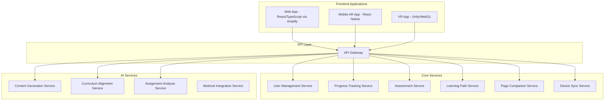

# AWS Amplify Integration for PageFlow Web Frontend

## Overview

This document outlines the integration of AWS Amplify for the PageFlow web frontend application, while maintaining the existing backend architecture using ECS with Fargate and Lambda. This hybrid approach leverages the strengths of Amplify for frontend development while preserving the flexibility and power of the microservices backend.

## Rationale for AWS Amplify

AWS Amplify provides significant advantages for the PageFlow web application:

1. **React/TypeScript Optimization**: Amplify is specifically designed to work seamlessly with React and TypeScript, which are the core technologies for our web frontend.

2. **Authentication Integration**: Amplify's authentication capabilities integrate directly with our existing Cognito setup, providing a consistent authentication experience.

3. **CI/CD Pipeline**: Amplify includes built-in CI/CD pipelines that streamline the deployment and testing of frontend changes.

4. **Accessibility Testing**: Amplify's testing tools align with our comprehensive accessibility requirements (WCAG 2.1 AA compliance).

5. **Preview Environments**: Amplify's preview environments support our human verification system for testing new features before production deployment.

6. **Simplified Hosting**: Amplify provides optimized hosting with global CDN distribution through CloudFront.

## Architecture Updates

### Updated High-Level Architecture



### Amplify-Specific Components

1. **Authentication**: 
   - Amplify Auth module connected to Amazon Cognito
   - Social sign-in integration
   - MFA support
   - Custom authentication flows

2. **Hosting & CI/CD**:
   - Automated builds on code commits
   - Preview environments for pull requests
   - Production deployment pipeline
   - Custom domain configuration with SSL

3. **Storage**:
   - S3 integration for user content and assets
   - Secure file uploads and downloads
   - Content delivery via CloudFront

4. **API Integration**:
   - GraphQL API for efficient data fetching
   - REST API integration with existing backend services
   - Real-time data with subscriptions

5. **Analytics & Monitoring**:
   - User behavior tracking
   - Error monitoring
   - Performance metrics

## Implementation Strategy

### Phase 1: Amplify Setup and Configuration

1. **Initialize Amplify Project**:
   - Set up Amplify CLI
   - Initialize Amplify in the web application
   - Configure environments (dev, test, prod)

2. **Authentication Setup**:
   - Configure Amplify Auth with Cognito
   - Set up user pools and identity pools
   - Implement authentication flows

3. **Hosting Configuration**:
   - Set up Amplify Hosting
   - Configure build settings
   - Set up custom domain and SSL

### Phase 2: Frontend Migration

1. **API Integration**:
   - Create API configurations for backend services
   - Implement API clients using Amplify
   - Set up authorization for API calls

2. **Storage Integration**:
   - Configure S3 storage for user content
   - Implement secure file upload/download
   - Set up content delivery

3. **State Management Integration**:
   - Adapt Redux store to work with Amplify
   - Implement offline data synchronization
   - Set up real-time data subscriptions

### Phase 3: CI/CD and Testing

1. **CI/CD Pipeline**:
   - Configure build specifications
   - Set up test environments
   - Implement deployment workflows

2. **Testing Framework**:
   - Integrate accessibility testing
   - Set up end-to-end testing
   - Implement visual regression testing

3. **Preview Environments**:
   - Configure branch previews
   - Set up pull request previews
   - Implement feedback collection

## AWS Amplify Features to Leverage

### Authentication

```javascript
import { Auth } from 'aws-amplify';

// Sign up
async function signUp(username, password, email) {
  try {
    const { user } = await Auth.signUp({
      username,
      password,
      attributes: {
        email
      }
    });
    return user;
  } catch (error) {
    console.error('Error signing up:', error);
    throw error;
  }
}

// Sign in
async function signIn(username, password) {
  try {
    const user = await Auth.signIn(username, password);
    return user;
  } catch (error) {
    console.error('Error signing in:', error);
    throw error;
  }
}
```

### API Integration

```javascript
import { API } from 'aws-amplify';

// REST API call
async function fetchLearningPaths() {
  try {
    const paths = await API.get('pageflowApi', '/learning-paths');
    return paths;
  } catch (error) {
    console.error('Error fetching learning paths:', error);
    throw error;
  }
}

// GraphQL query
async function fetchUserProgress(userId) {
  try {
    const query = `
      query GetUserProgress($userId: ID!) {
        getUserProgress(userId: $userId) {
          id
          pathId
          completion
          lastAccessedAt
        }
      }
    `;
    
    const variables = { userId };
    const result = await API.graphql({ query, variables });
    return result.data.getUserProgress;
  } catch (error) {
    console.error('Error fetching user progress:', error);
    throw error;
  }
}
```

### Storage

```javascript
import { Storage } from 'aws-amplify';

// Upload file
async function uploadFile(file, key) {
  try {
    const result = await Storage.put(key, file, {
      contentType: file.type,
      level: 'protected'
    });
    return result;
  } catch (error) {
    console.error('Error uploading file:', error);
    throw error;
  }
}

// Get file
async function getFile(key) {
  try {
    const url = await Storage.get(key, { level: 'protected' });
    return url;
  } catch (error) {
    console.error('Error getting file:', error);
    throw error;
  }
}
```

## Benefits of the Hybrid Approach

1. **Specialized Tooling**: Using the right tool for each part of the application - Amplify for frontend and ECS/Lambda for backend services.

2. **Faster Frontend Development**: Amplify's built-in components and libraries accelerate frontend development.

3. **Simplified Authentication**: Seamless integration with Cognito reduces authentication complexity.

4. **Improved CI/CD**: Automated frontend deployment pipeline with preview environments.

5. **Enhanced Testing**: Better support for accessibility and frontend testing.

6. **Flexible Backend**: Maintaining the microservices architecture for backend services preserves flexibility and scalability.

7. **Cost Optimization**: Using managed services appropriately for each part of the application.

## Conclusion

Integrating AWS Amplify for the PageFlow web frontend while maintaining the existing backend architecture provides the best of both worlds. This approach leverages Amplify's strengths for frontend development while preserving the flexibility and power of our microservices backend architecture.