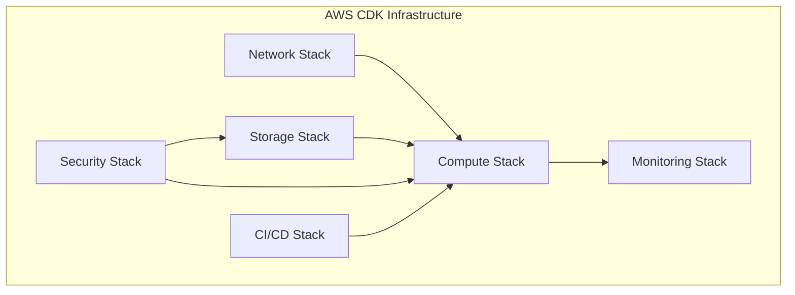
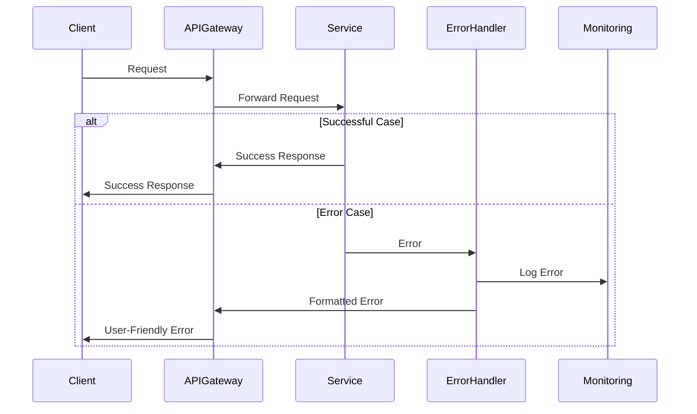
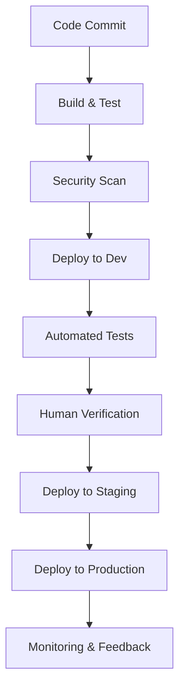

# Design Document: PageFlow AI Learning Platform

## Overview

PageFlow is a cross-platform AI-powered learning platform that operates across web, mobile AR, and VR environments. The platform provides personalized, accessible, and engaging educational experiences through a microservices architecture built on AWS. At the heart of the platform is "Page," an AI companion character that guides users through their learning journey, adapting to different platforms and user needs.

This design document outlines the architecture, components, interfaces, data models, error handling, and testing strategy for the PageFlow platform, ensuring alignment with the requirements specified in the requirements document.

## Architecture

PageFlow follows a microservices architecture fully deployed on AWS, with separate frontend applications for web, mobile AR, and VR experiences. The architecture is designed to be scalable, resilient, and to support independent deployment of services. Given the high budget allocation for AWS resources, we'll utilize premium AWS services to ensure maximum performance, reliability, and security.

### Purpose of the Design Document

This design document serves several critical purposes:

1. **Blueprint for Implementation**: It provides a detailed technical blueprint that developers will follow during implementation, ensuring consistency across the entire platform.

2. **Architecture Definition**: It defines the system architecture, showing how different components interact and communicate with each other.

3. **Technical Decisions**: It documents key technical decisions and their rationales, serving as a reference for the development team.

4. **Data Model Specification**: It specifies the data models and database schema that will be implemented.

5. **Integration Points**: It identifies integration points between different services and external systems.

6. **Error Handling Strategy**: It outlines how errors will be handled consistently across the platform.

7. **Testing Approach**: It defines the testing strategy to ensure quality and reliability.

8. **Security Considerations**: It addresses security requirements and implementation approaches.

9. **AWS Infrastructure Planning**: It details how AWS services will be utilized to build a robust, scalable platform.

### AWS-First Approach

We'll implement a cost-effective AWS-first approach that doesn't compromise on quality:

1. **Right-Sized Resources**: Carefully sizing AWS resources based on actual needs with room for scaling
2. **Strategic Multi-AZ Deployment**: Using multi-AZ deployment for high availability with selective multi-region for critical components
3. **Reserved Instances**: Using reserved instances for cost optimization of predictable workloads
4. **Managed Services**: Leveraging AWS managed services to reduce operational overhead while controlling costs
5. **Auto-scaling**: Implementing proper auto-scaling to ensure resources match demand

### High-Level Architecture Diagram

```mermaid
graph TD
    subgraph "Frontend Applications"
        WebApp[Web App - React/TypeScript via Amplify]
        MobileApp[Mobile AR App - React Native]
        VRApp[VR App - Unity/WebGL]
    end

    subgraph "AWS Amplify"
        AmplifyAuth[Amplify Auth]
        AmplifyHosting[Amplify Hosting]
        AmplifyStorage[Amplify Storage]
        AmplifyAPI[Amplify API]
    end

    subgraph "API Layer"
        APIGateway[API Gateway]
    end

    subgraph "Core Services"
        UserService[User Management Service]
        ProgressService[Progress Tracking Service]
        AssessmentService[Assessment Service]
        LearningPathService[Learning Path Service]
        PageCompanionService[Page Companion Service]
        DeviceSyncService[Device Sync Service]
    end

    subgraph "AI Services"
        ContentGenService[Content Generation Service]
        CurriculumAlignService[Curriculum Alignment Service]
        AssignmentAnalysisService[Assignment Analysis Service]
        BedrockIntegrationService[Bedrock Integration Service]
    end

    subgraph "Data Layer"
        DynamoDB[(DynamoDB)]
        PostgreSQL[(PostgreSQL)]
        Redis[(Redis Cache)]
    end

    subgraph "Shared Packages"
        SharedTypes[Shared Types]
        SharedUtils[Shared Utils]
        DBUtils[Database Utils]
        TestingFramework[Testing Framework]
    end

    WebApp --> AmplifyAPI
    WebApp --> AmplifyAuth
    WebApp --> AmplifyStorage
    AmplifyHosting --> WebApp
    AmplifyAPI --> APIGateway
    AmplifyAuth --> Cognito
    MobileApp --> APIGateway
    VRApp --> APIGateway
    
    APIGateway --> UserService
    APIGateway --> ProgressService
    APIGateway --> AssessmentService
    APIGateway --> LearningPathService
    APIGateway --> PageCompanionService
    APIGateway --> DeviceSyncService
    APIGateway --> ContentGenService
    APIGateway --> CurriculumAlignService
    APIGateway --> AssignmentAnalysisService
    
    UserService --> DynamoDB
    ProgressService --> DynamoDB
    AssessmentService --> PostgreSQL
    LearningPathService --> PostgreSQL
    PageCompanionService --> DynamoDB
    DeviceSyncService --> Redis
    
    ContentGenService --> BedrockIntegrationService
    CurriculumAlignService --> PostgreSQL
    AssignmentAnalysisService --> BedrockIntegrationService
    
    UserService -.-> SharedTypes
    ProgressService -.-> SharedTypes
    AssessmentService -.-> SharedTypes
    LearningPathService -.-> SharedTypes
    PageCompanionService -.-> SharedTypes
    DeviceSyncService -.-> SharedTypes
    ContentGenService -.-> SharedTypes
    CurriculumAlignService -.-> SharedTypes
    AssignmentAnalysisService -.-> SharedTypes
    
    UserService -.-> SharedUtils
    ProgressService -.-> SharedUtils
    AssessmentService -.-> SharedUtils
    LearningPathService -.-> SharedUtils
    PageCompanionService -.-> SharedUtils
    DeviceSyncService -.-> SharedUtils
    ContentGenService -.-> SharedUtils
    CurriculumAlignService -.-> SharedUtils
    AssignmentAnalysisService -.-> SharedUtils
    
    UserService -.-> DBUtils
    ProgressService -.-> DBUtils
    AssessmentService -.-> DBUtils
    LearningPathService -.-> DBUtils
    PageCompanionService -.-> DBUtils
    DeviceSyncService -.-> DBUtils
    ContentGenService -.-> DBUtils
    CurriculumAlignService -.-> DBUtils
    AssignmentAnalysisService -.-> DBUtils
```



### Infrastructure Architecture

The infrastructure is managed using AWS CDK with separate stacks for different concerns, ensuring a cost-effective yet robust deployment:



#### AWS Services by Stack

1. **Network Stack**
   - **Amazon VPC**: Virtual private cloud with public and private subnets across multiple availability zones
   - **AWS Transit Gateway**: For connecting multiple VPCs if needed
   - **Amazon Route 53**: DNS management and routing policies
   - **AWS WAF**: Web application firewall for protecting APIs and web applications
   - **Amazon CloudFront**: Content delivery network for frontend assets

2. **Storage Stack**
   - **Amazon DynamoDB**: For NoSQL data with on-demand capacity for cost optimization
   - **Amazon RDS for PostgreSQL**: For relational data with Multi-AZ for high availability
   - **Amazon S3**: For object storage of learning content and assets
   - **Amazon ElastiCache (Redis)**: For caching and session management
   - **Amazon S3 Glacier**: For archival of infrequently accessed data

3. **Compute Stack**
   - **Amazon ECS with AWS Fargate**: For containerized microservices with serverless container management
   - **AWS Lambda**: For event-driven and lightweight processing
   - **Amazon API Gateway**: For API management with throttling and caching
   - **AWS Amplify**: For web frontend hosting, authentication, and CI/CD
   - **Amazon EC2**: Selectively used for specialized workloads (like VR rendering)

4. **Monitoring Stack**
   - **Amazon CloudWatch**: For metrics, logs, and alarms
   - **AWS X-Ray**: For distributed tracing
   - **Amazon OpenSearch Service**: For log analysis and visualization
   - **AWS CloudTrail**: For API and user activity logging
   - **Amazon EventBridge**: For event-driven monitoring and alerting

5. **CI/CD Stack**
   - **AWS Amplify Console**: For web frontend CI/CD with preview environments
   - **AWS CodePipeline**: For continuous delivery pipelines for backend services
   - **AWS CodeBuild**: For building and testing code
   - **AWS CodeDeploy**: For automated deployments
   - **Amazon ECR**: For container image registry
   - **AWS CodeArtifact**: For artifact management

6. **Security Stack**
   - **AWS IAM**: For identity and access management
   - **Amazon Cognito**: For user authentication and authorization
   - **AWS KMS**: For encryption key management
   - **AWS Secrets Manager**: For secrets management
   - **Amazon GuardDuty**: For threat detection
   - **AWS Security Hub**: For security posture management

## Components and Interfaces

### Frontend Applications

#### Web App (React/TypeScript with AWS Amplify)
- **Responsibilities**: Provide browser-based access to the learning platform with responsive design
- **Key Components**:
  - Dashboard Component: Displays user progress and learning paths
  - Content Viewer: Renders learning content with accessibility features
  - Page Companion Interface: Integrates the AI companion into the web experience
  - Assessment Module: Handles quizzes and assignments
- **Technologies**: React, TypeScript, AWS Amplify, Styled Components, React Router, Redux Toolkit
- **Amplify Features**:
  - Authentication: User sign-up, sign-in, and profile management
  - Hosting: CI/CD pipeline with preview environments
  - Storage: S3 integration for user content and assets
  - API: GraphQL and REST API integration with backend services

#### Mobile AR App (React Native)
- **Responsibilities**: Deliver mobile experience with AR capabilities
- **Key Components**:
  - AR Content Renderer: Displays AR learning experiences
  - Mobile-optimized UI Components
  - Offline Mode Handler: Manages offline learning and synchronization
  - Device Sensors Integration: Utilizes device capabilities for AR
- **Technologies**: React Native, TypeScript, ARKit (iOS), ARCore (Android)

#### VR App (Unity/WebGL)
- **Responsibilities**: Provide immersive VR learning experiences
- **Key Components**:
  - VR Interaction System: Handles user input in VR environment
  - 3D Learning Environment: Renders immersive educational spaces
  - VR-optimized Page Companion: 3D version of the AI companion
  - Spatial Audio System: Enhances immersion with directional audio
- **Technologies**: Unity, WebGL, C#

### Core Services

#### API Gateway
- **Responsibilities**: Route requests to appropriate microservices, handle authentication
- **Interfaces**:
  - REST API endpoints for all client applications
  - WebSocket connections for real-time features
- **Technologies**: AWS API Gateway, Lambda Authorizers

#### User Management Service
- **Responsibilities**: Handle user authentication, profiles, and preferences
- **Key Endpoints**:
  - `/users` - CRUD operations for user profiles
  - `/auth` - Authentication endpoints
  - `/preferences` - User preference management
- **Technologies**: Node.js, TypeScript, AWS Cognito integration

#### Progress Tracking Service
- **Responsibilities**: Track and report user learning progress
- **Key Endpoints**:
  - `/progress` - Record and retrieve progress data
  - `/milestones` - Milestone achievement tracking
  - `/reports` - Generate progress reports
- **Technologies**: Node.js, TypeScript, DynamoDB

#### Assessment Service
- **Responsibilities**: Manage quizzes, assignments, and evaluations
- **Key Endpoints**:
  - `/assessments` - CRUD for assessment resources
  - `/submissions` - Handle assessment submissions
  - `/feedback` - Provide assessment feedback
- **Technologies**: Node.js, TypeScript, PostgreSQL

#### Learning Path Service
- **Responsibilities**: Define and manage learning paths and curriculum
- **Key Endpoints**:
  - `/paths` - CRUD for learning paths
  - `/modules` - Learning module management
  - `/recommendations` - Personalized path recommendations
- **Technologies**: Node.js, TypeScript, PostgreSQL

#### Page Companion Service
- **Responsibilities**: Control the Page mascot character across platforms
- **Key Endpoints**:
  - `/interactions` - Manage Page interactions
  - `/personality` - Configure Page personality
  - `/responses` - Generate contextual responses
- **Technologies**: Node.js, TypeScript, AWS Bedrock integration

#### Device Sync Service
- **Responsibilities**: Synchronize user state across devices
- **Key Endpoints**:
  - `/sync` - Synchronize user data
  - `/devices` - Manage registered devices
  - `/offline` - Handle offline data reconciliation
- **Technologies**: Node.js, TypeScript, Redis, WebSockets

### AI Services

#### Content Generation Service
- **Responsibilities**: Generate AI-powered learning content
- **Key Endpoints**:
  - `/generate` - Generate new content
  - `/adapt` - Adapt content to user needs
  - `/validate` - Validate generated content
- **Technologies**: Node.js, TypeScript, AWS Bedrock

#### Curriculum Alignment Service
- **Responsibilities**: Ensure content aligns with educational standards
- **Key Endpoints**:
  - `/standards` - Manage curriculum standards
  - `/mapping` - Map content to standards
  - `/coverage` - Report on standards coverage
- **Technologies**: Node.js, TypeScript, PostgreSQL

#### Assignment Analysis Service
- **Responsibilities**: Analyze student assignments and provide feedback
- **Key Endpoints**:
  - `/analyze` - Analyze submitted assignments
  - `/feedback` - Generate personalized feedback
  - `/plagiarism` - Check for academic integrity
- **Technologies**: Node.js, TypeScript, AWS Bedrock

#### Bedrock Integration Service
- **Responsibilities**: Centralize integration with AWS Bedrock for AI capabilities
- **Key Endpoints**:
  - `/models` - Access to AI models
  - `/embeddings` - Generate text embeddings
  - `/completions` - Text completion capabilities
  - `/image-generation` - Generate images for learning content
  - `/content-moderation` - Ensure content appropriateness
- **Technologies**: Node.js, TypeScript, AWS Bedrock SDK
- **AWS Bedrock Models**:
  - Claude (Anthropic) for conversational AI and content generation
  - Stable Diffusion for image generation
  - Amazon Titan for embeddings and text processing
  - Cohere for content summarization and classification
- **Integration Features**:
  - Model caching for improved performance
  - Prompt management system
  - Cost monitoring and optimization
  - Fallback strategies for model availability

### Shared Packages

#### Shared Types
- **Responsibilities**: Define TypeScript interfaces shared across the project
- **Key Components**:
  - Data model interfaces
  - API request/response types
  - Event types for cross-service communication

#### Shared Utils
- **Responsibilities**: Provide common utilities for error handling, logging, etc.
- **Key Components**:
  - Error handling utilities
  - Logging framework
  - Date/time utilities
  - Security utilities

#### Database Utils
- **Responsibilities**: Provide database connection and repository patterns
- **Key Components**:
  - Connection managers for different databases
  - Repository base classes
  - Query builders
  - Transaction managers

#### Testing Framework
- **Responsibilities**: Support comprehensive testing across the platform
- **Key Components**:
  - Test runners
  - Assertion libraries
  - Mocking utilities
  - Test data generators

## Data Models

### Core Data Models

#### User
```typescript
interface User {
  id: string;
  email: string;
  displayName: string;
  profilePicture?: string;
  preferences: UserPreferences;
  accessibilitySettings: AccessibilitySettings;
  createdAt: Date;
  updatedAt: Date;
}

interface UserPreferences {
  theme: 'light' | 'dark' | 'high-contrast';
  notificationSettings: NotificationSettings;
  contentPreferences: ContentPreferences;
  pageCompanionSettings: PageCompanionSettings;
}

interface AccessibilitySettings {
  screenReader: boolean;
  reducedMotion: boolean;
  highContrast: boolean;
  fontSize: 'small' | 'medium' | 'large' | 'x-large';
  readingLevel: 'elementary' | 'intermediate' | 'advanced' | 'expert';
  alternativeInputEnabled: boolean;
  alternativeInputType?: 'voice' | 'switch' | 'eye-tracking';
}
```

#### Learning Path
```typescript
interface LearningPath {
  id: string;
  title: string;
  description: string;
  modules: Module[];
  prerequisites?: string[]; // IDs of prerequisite paths
  curriculumStandards: CurriculumStandard[];
  estimatedDuration: number; // in minutes
  difficulty: 'beginner' | 'intermediate' | 'advanced' | 'expert';
  tags: string[];
  createdAt: Date;
  updatedAt: Date;
}

interface Module {
  id: string;
  title: string;
  description: string;
  units: Unit[];
  estimatedDuration: number; // in minutes
  assessmentId?: string;
}

interface Unit {
  id: string;
  title: string;
  description: string;
  contentItems: ContentItem[];
  estimatedDuration: number; // in minutes
}

interface ContentItem {
  id: string;
  type: 'video' | 'text' | 'interactive' | 'ar' | 'vr' | 'quiz';
  title: string;
  content: any; // Specific to content type
  metadata: ContentMetadata;
  accessibilityFeatures: AccessibilityFeatures;
}
```

#### Progress
```typescript
interface Progress {
  userId: string;
  pathId: string;
  moduleProgress: ModuleProgress[];
  overallCompletion: number; // Percentage
  startedAt: Date;
  lastAccessedAt: Date;
  completedAt?: Date;
  deviceSyncStatus: DeviceSyncStatus;
}

interface ModuleProgress {
  moduleId: string;
  unitProgress: UnitProgress[];
  completion: number; // Percentage
  startedAt: Date;
  completedAt?: Date;
}

interface UnitProgress {
  unitId: string;
  contentProgress: ContentProgress[];
  completion: number; // Percentage
  startedAt: Date;
  completedAt?: Date;
}

interface ContentProgress {
  contentItemId: string;
  status: 'not_started' | 'in_progress' | 'completed';
  timeSpent: number; // in seconds
  lastPosition?: number; // For resuming content
  completedAt?: Date;
}
```

#### Assessment
```typescript
interface Assessment {
  id: string;
  title: string;
  description: string;
  questions: Question[];
  passingScore: number;
  timeLimit?: number; // in minutes
  attempts: number; // max attempts allowed
  curriculumStandards: CurriculumStandard[];
  createdAt: Date;
  updatedAt: Date;
}

interface Question {
  id: string;
  type: 'multiple_choice' | 'true_false' | 'short_answer' | 'essay' | 'interactive';
  prompt: string;
  options?: string[]; // For multiple choice
  correctAnswer?: any; // Depends on question type
  points: number;
  difficulty: 'easy' | 'medium' | 'hard';
  feedback?: {
    correct: string;
    incorrect: string;
  };
}

interface AssessmentSubmission {
  id: string;
  userId: string;
  assessmentId: string;
  answers: Answer[];
  score: number;
  passed: boolean;
  feedback: string;
  startedAt: Date;
  submittedAt: Date;
  gradedAt?: Date;
  attemptNumber: number;
}
```

#### Page Companion
```typescript
interface PageCompanion {
  userId: string;
  personality: PersonalityTraits;
  interactionHistory: Interaction[];
  knowledgeBase: KnowledgeItem[];
  emotionalState: EmotionalState;
  adaptations: PlatformAdaptation[];
}

interface PersonalityTraits {
  enthusiasm: number; // 1-10
  helpfulness: number; // 1-10
  humor: number; // 1-10
  formality: number; // 1-10
  customizations: Record<string, any>;
}

interface Interaction {
  id: string;
  timestamp: Date;
  context: string;
  userInput?: string;
  response: string;
  emotionalResponse?: string;
  platform: 'web' | 'mobile' | 'ar' | 'vr';
}

interface EmotionalState {
  currentEmotion: 'neutral' | 'happy' | 'excited' | 'concerned' | 'thoughtful';
  intensity: number; // 1-10
  trigger?: string;
}

interface PlatformAdaptation {
  platform: 'web' | 'mobile' | 'ar' | 'vr';
  visualRepresentation: string; // URL or reference
  interactionModel: string;
  voiceProfile?: string;
}
```

#### Curriculum Standard
```typescript
interface CurriculumStandard {
  id: string;
  code: string;
  name: string;
  description: string;
  category: string;
  subcategory?: string;
  gradeLevel: string[];
  jurisdiction: 'US' | 'UK' | 'AU' | 'CA' | 'International';
  framework: string; // e.g., "Common Core", "Australian Curriculum"
  contentMappings: ContentMapping[];
}

interface ContentMapping {
  contentId: string;
  contentType: 'path' | 'module' | 'unit' | 'content_item' | 'assessment';
  alignmentStrength: 'strong' | 'moderate' | 'weak';
  notes?: string;
}
```

### Database Schema Design

The platform will use a combination of DynamoDB for NoSQL data and PostgreSQL for relational data:

#### DynamoDB Tables
- **Users Table**: User profiles and preferences
- **Progress Table**: User progress tracking with GSIs for querying
- **Page Companion Table**: AI companion data and interaction history
- **Device Sync Table**: Cross-device synchronization data

#### PostgreSQL Schemas
- **Curriculum Schema**: Tables for curriculum standards and mappings
- **Content Schema**: Tables for learning paths, modules, units, and content items
- **Assessment Schema**: Tables for assessments, questions, and submissions

## Error Handling

### Error Handling Strategy

The platform implements a comprehensive error handling strategy:

1. **Standardized Error Format**:
```typescript
interface ErrorResponse {
  code: string;
  message: string;
  details?: any;
  timestamp: string;
  requestId: string;
  path: string;
}
```

2. **Error Categories**:
   - Validation Errors (400)
   - Authentication Errors (401)
   - Authorization Errors (403)
   - Not Found Errors (404)
   - Conflict Errors (409)
   - Internal Server Errors (500)
   - Service Unavailable Errors (503)

3. **Circuit Breaking**: Implement circuit breakers between services to prevent cascading failures

4. **Retry Policies**: Define service-specific retry policies with exponential backoff

5. **Fallback Mechanisms**: Provide graceful degradation when services are unavailable

6. **Error Logging and Monitoring**: Centralized error logging with correlation IDs

7. **User-Friendly Error Messages**: Transform technical errors into user-friendly messages

### Error Handling Flow



## Testing Strategy

### Testing Levels

1. **Unit Testing**:
   - Test individual functions and components
   - Mock external dependencies
   - Achieve high code coverage (target: 90%+)
   - Tools: Jest, React Testing Library

2. **Integration Testing**:
   - Test service interactions
   - Test database operations
   - Verify API contracts
   - Tools: Jest, Supertest

3. **End-to-End Testing**:
   - Test critical user journeys
   - Cross-platform compatibility testing
   - Tools: Playwright, Cypress, Amplify Testing Library

4. **Amplify-Specific Testing**:
   - Test authentication flows
   - Verify storage operations
   - Validate API integrations
   - Tools: Amplify Testing Library, AWS Device Farm

4. **Accessibility Testing**:
   - Automated accessibility checks
   - Screen reader compatibility testing
   - Tools: axe-core, Lighthouse

5. **Performance Testing**:
   - Load testing for critical paths
   - Response time benchmarking
   - Tools: k6, Artillery

6. **AI Content Quality Testing**:
   - Validate AI-generated content quality
   - Test curriculum alignment accuracy
   - Custom testing frameworks

### Continuous Testing

1. **Pre-commit Hooks**:
   - Lint checks
   - Type checking
   - Unit tests for changed files

2. **CI Pipeline Testing**:
   - Run all unit tests
   - Run integration tests
   - Run E2E tests for critical paths
   - Accessibility compliance checks

3. **Human Verification**:
   - Amplify preview environments for web frontend verification
   - Dedicated testing environments for backend services
   - Automated deployment of features for testing
   - Feedback tracking system

4. **Real-Time Deployment**:
   - Automated deployment to development environments
   - Real-time visibility into deployment process
   - Rollback capabilities for failed deployments

### Test Data Management

1. **Test Data Factories**:
   - Generate consistent test data
   - Support various test scenarios
   - Maintain referential integrity

2. **Seeded Test Environments**:
   - Pre-populated test databases
   - Consistent starting state for tests
   - Reset capabilities between test runs

3. **Anonymized Production Data**:
   - Safely use anonymized production data for testing
   - Comply with data protection regulations
   - Refresh periodically to capture real-world scenarios

## Security Considerations

### Authentication and Authorization

1. **User Authentication**:
   - JWT-based authentication
   - OAuth 2.0 integration for third-party authentication
   - Multi-factor authentication for sensitive operations

2. **Service-to-Service Authentication**:
   - mTLS for service-to-service communication
   - Service account credentials
   - Short-lived tokens

3. **Authorization**:
   - Role-based access control (RBAC)
   - Attribute-based access control (ABAC) for fine-grained permissions
   - Permission verification at API Gateway and service levels

### Data Protection

1. **Encryption**:
   - Data encryption at rest
   - TLS for data in transit
   - Field-level encryption for sensitive data

2. **Data Access Controls**:
   - Least privilege principle
   - Data access auditing
   - Data masking for sensitive information

3. **Compliance**:
   - GDPR compliance mechanisms
   - COPPA compliance for educational data
   - Regular compliance audits

### Security Monitoring

1. **Threat Detection**:
   - Anomaly detection
   - Intrusion detection systems
   - Regular security scans

2. **Vulnerability Management**:
   - Automated dependency scanning
   - Regular security patching
   - Penetration testing

3. **Incident Response**:
   - Defined security incident response procedures
   - Automated alerts for security events
   - Regular security drills

## Deployment and DevOps

### CI/CD Pipeline



### Environment Strategy

1. **Development Environment**:
   - Individual developer environments
   - Shared development environment
   - Feature branch environments

2. **Testing Environments**:
   - Integration testing environment
   - Performance testing environment
   - Accessibility testing environment

3. **Staging Environment**:
   - Production-like configuration
   - Final verification before production
   - Blue/green deployment capability

4. **Production Environment**:
   - Multi-region deployment
   - Auto-scaling configuration
   - High availability setup

### Monitoring and Observability

1. **Metrics Collection**:
   - Service-level metrics
   - Business metrics
   - User experience metrics

2. **Logging**:
   - Centralized log aggregation
   - Structured logging format
   - Log retention policies

3. **Tracing**:
   - Distributed tracing across services
   - Performance bottleneck identification
   - End-to-end request tracking

4. **Alerting**:
   - Automated alerts for anomalies
   - On-call rotation
   - Incident management integration

## Accessibility Implementation

### Web Accessibility

1. **WCAG 2.1 AA Compliance**:
   - Semantic HTML structure
   - Proper ARIA attributes
   - Keyboard navigation support
   - Focus management

2. **Screen Reader Support**:
   - Alternative text for images
   - Descriptive labels for interactive elements
   - Proper heading structure
   - ARIA live regions for dynamic content

3. **Visual Adaptations**:
   - High contrast mode
   - Text resizing support
   - Color blindness considerations
   - Reduced motion option

### Mobile Accessibility

1. **Native Accessibility APIs**:
   - iOS VoiceOver support
   - Android TalkBack support
   - Accessibility service integration

2. **Touch Accommodations**:
   - Large touch targets
   - Touch alternatives
   - Gesture simplification options

3. **Mobile-Specific Features**:
   - Device orientation considerations
   - Vibration feedback options
   - Voice command integration

### VR Accessibility

1. **Alternative Interaction Methods**:
   - Gaze-based interaction
   - Voice command support
   - Single-button mode

2. **Sensory Accommodations**:
   - Reduced visual stimulation mode
   - Audio description options
   - Haptic feedback alternatives

3. **Physical Considerations**:
   - Seated mode options
   - Reduced movement requirements
   - Fatigue reduction features

## Agent Hooks Implementation

### TypeScript Validator Hook

1. **Trigger**: File save events for .ts and .tsx files
2. **Actions**:
   - Run TypeScript compiler in check mode
   - Run ESLint with TypeScript rules
   - Report errors directly in the IDE
3. **Implementation**:
   - Watch file system events
   - Execute validation in background process
   - Parse and format error output
   - Display results in IDE

### API Integration Validator

1. **Trigger**: Modification of API-related files
2. **Actions**:
   - Check for breaking changes in API interfaces
   - Validate against OpenAPI specifications
   - Ensure backward compatibility
3. **Implementation**:
   - Parse API definitions
   - Compare with previous versions
   - Apply compatibility rules
   - Generate compatibility report

### Curriculum Data Validator

1. **Trigger**: Modification of curriculum data files
2. **Actions**:
   - Validate curriculum data against schema
   - Check for required educational metadata
   - Verify curriculum standard references
3. **Implementation**:
   - Apply JSON Schema validation
   - Check for required educational fields
   - Verify references to curriculum standards
   - Generate validation report

### Emotional Design Review

1. **Trigger**: Modification of UI components
2. **Actions**:
   - Check for animation implementations
   - Ensure accessibility features are maintained
   - Provide suggestions for improving user delight
3. **Implementation**:
   - Analyze component structure
   - Check for animation properties
   - Verify accessibility attributes
   - Generate suggestions based on emotional design principles

### Update Tests Hook

1. **Trigger**: Modification of implementation files
2. **Actions**:
   - Analyze code changes
   - Update corresponding test files
   - Suggest new test cases
3. **Implementation**:
   - Parse code changes
   - Identify testable functions and components
   - Generate or update test templates
   - Suggest test cases based on code paths

### Curriculum Alignment Check

1. **Trigger**: Modification of learning content
2. **Actions**:
   - Check content against defined curriculum standards
   - Identify gaps in curriculum coverage
   - Suggest improvements for alignment
3. **Implementation**:
   - Extract content metadata
   - Compare with curriculum standards database
   - Identify missing or weak alignments
   - Generate alignment report

## Conclusion

This design document provides a comprehensive blueprint for the PageFlow AI Learning Platform, addressing all requirements specified in the requirements document. The architecture is designed to be scalable, resilient, and adaptable to the needs of different platforms and user accessibility requirements.

The microservices approach allows for independent development and deployment of components, while the shared packages ensure consistency across the platform. The AI integration, particularly through the Page companion character, provides a personalized and engaging learning experience.

The implementation of agent hooks ensures code quality, API compatibility, curriculum alignment, and emotional design principles are maintained throughout the development process.

This design sets the foundation for a robust, accessible, and engaging learning platform that can operate seamlessly across web, mobile AR, and VR environments.